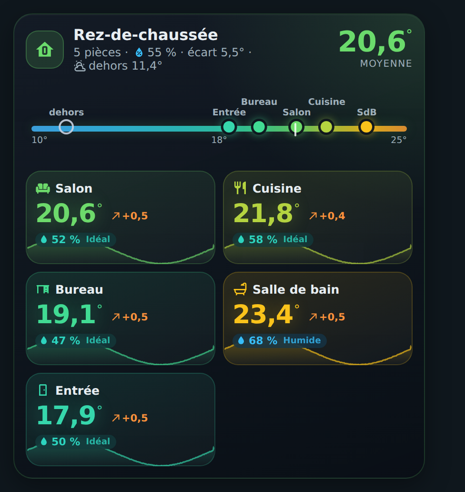
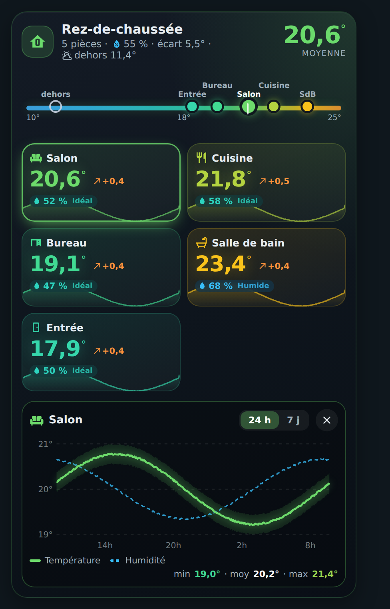

# 🏠 HOLM Floor Card

[](https://hacs.xyz/)


**Toutes les températures d'un étage en un coup d'œil : où il fait trop chaud, trop froid, trop humide, et comment ça évolue.**

HOLM Floor Card regroupe les sondes de température (et d'humidité) d'un étage dans une seule carte colorée : une **bande thermique** place chaque pièce sur une échelle de couleurs, et chaque pièce a sa tuile avec sa **tendance sur 1 h** et sa **mini-courbe sur 24 h**. Un toucher sur une pièce ouvre son **graphique détaillé**.

> ✨ **Zéro YAML, aucun helper.** Les courbes viennent directement des statistiques de Home Assistant. Tout se règle dans l'éditeur visuel.

### En bref

- 🌡️ **En-tête** : moyenne de l'étage, humidité moyenne, écart entre la pièce la plus froide et la plus chaude, température extérieure.
- 🌈 **Bande thermique** : chaque pièce (et l'extérieur) placée sur une échelle de couleurs, du bleu au rouge.
- 🧱 **Tuiles pièces** : température colorée, tendance sur une heure (↗ / ↘), humidité avec son niveau (Sec, Idéal, Humide…), mini-courbe 24 h.
- 📈 **Graphique détaillé** au toucher : température et humidité sur **24 h ou 7 jours**, avec min / moyenne / max.
- 👆 Appui long sur une pièce : fiche de l'entité.

| Vue d'ensemble | Graphique d'une pièce |
|---|---|
|  |  |

---

## Installation

### Avec HACS (recommandé)

1. HACS → menu ⋮ → **Dépôts personnalisés**.
2. Ajoutez `https://github.com/kaaribou/holm-floor-card`, catégorie **Tableau de bord** (*Dashboard / Plugin*).
3. Recherchez la carte → **Télécharger**.
4. Rechargez la page (Ctrl + F5).

### Manuellement

1. Copiez `dist/holm-floor-card.js` dans `config/www/community/holm-floor-card/`.
2. **Paramètres → Tableaux de bord → ⋮ → Ressources → Ajouter** : `/local/community/holm-floor-card/holm-floor-card.js`, type **Module JavaScript**.
3. Rechargez la page.

---

## Utilisation

Ajoutez la carte **HOLM Étage**, donnez-lui un titre et ajoutez vos pièces dans l'éditeur (bouton **Ajouter une pièce**).

```yaml
type: custom:holm-floor-card
title: Rez-de-chaussée
icon: mdi:home-floor-0
outdoor_entity: sensor.temperature_exterieure
rooms:
  - name: Salon
    icon: mdi:sofa
    temperature: sensor.salon_temperature
    humidity: sensor.salon_humidite
  - name: Salle de bain
    short: SdB
    temperature: sensor.sdb_temperature
```

## Options

| Option | Description | Par défaut |
|---|---|---|
| `title` / `icon` | Titre et icône de l'étage | `Étage` / `mdi:home-floor-0` |
| `outdoor_entity` | Température extérieure (affichée dans l'en-tête et sur la bande) | — |
| `hours` | Durée des mini-courbes (h) | `24` |
| `show_humidity` | Afficher l'humidité | `true` |
| `rooms` | Pièces : `name`, `icon`, `temperature` (**obligatoire**), `humidity`, `short` (nom court sur la bande) | — |

## FAQ

| Problème | Solution |
|---|---|
| Pas de courbe | La sonde n'a pas de statistiques : elle doit avoir un `state_class` (`measurement`). |
| Noms qui se chevauchent sur la bande | Donnez un nom court (`short`) aux pièces aux noms longs. |
| La nouvelle version ne s'affiche pas | Videz le cache (Ctrl + F5). |

---

## Un petit merci ?

La carte vous plaît ? Vous pouvez m'offrir une bière 🍺

[](https://paypal.me/kaaribou)

---

## Licence

Code : licence **MIT** — © kaaribou. Voir le [CHANGELOG](CHANGELOG.md).

Fait partie de la collection **HOLM** : [Carburant HOLM](https://github.com/kaaribou/carburant-holm) · [HOLM Navbar Card](https://github.com/kaaribou/holm-navbar-card) · [HOLM Music Card](https://github.com/kaaribou/holm-music-card) · [HOLM Sentinel Card](https://github.com/kaaribou/holm-sentinel-card).
